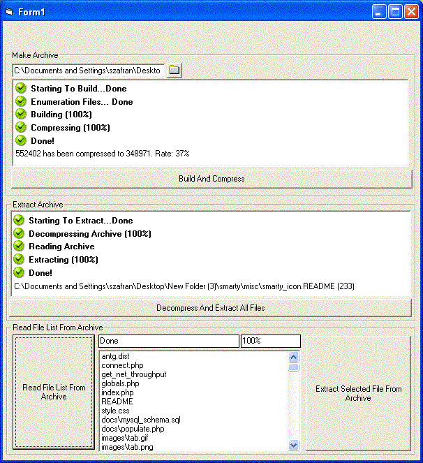



## Archive Compression/Decompression Control \(included subfolders\)

### Description

This is a control i wrote that contains all functions for a good archive and compression program. I did not create am example program yet but i did include a a fw test functions that will show you how it creats an arhive from a folder and subfolers and how to extract all files form that archive as well as a single file. Each function included the option for compression/decompression. I am currently working on a program that will demonstraight how to use each function to their best ability. i figures i would post the control so you people can play around with it.
 
### More Info
 

             |
---                |---
**Submitted On**   |2004-08-11 10:58:58
**By**             |[Eric Wolcott](https://github.com/Planet-Source-Code/PSCIndex/blob/master/ByAuthor/eric-wolcott.md)
**Level**          |Intermediate
**User Rating**    |4.4 (40 globes from 9 users)
**Compatibility**  |VB 3\.0, VB 4\.0 \(16\-bit\), VB 4\.0 \(32\-bit\), VB 5\.0, VB 6\.0
**Category**       |[Files/ File Controls/ Input/ Output](https://github.com/Planet-Source-Code/PSCIndex/blob/master/ByCategory/files-file-controls-input-output__1-3.md)
**World**          |[Visual Basic](https://github.com/Planet-Source-Code/PSCIndex/blob/master/ByWorld/visual-basic.md)
**Archive File**   |[Archive\_Co1780748112004\.zip](https://github.com/Planet-Source-Code/eric-wolcott-archive-compression-decompression-control-included-subfolders__1-55505/archive/master.zip)

